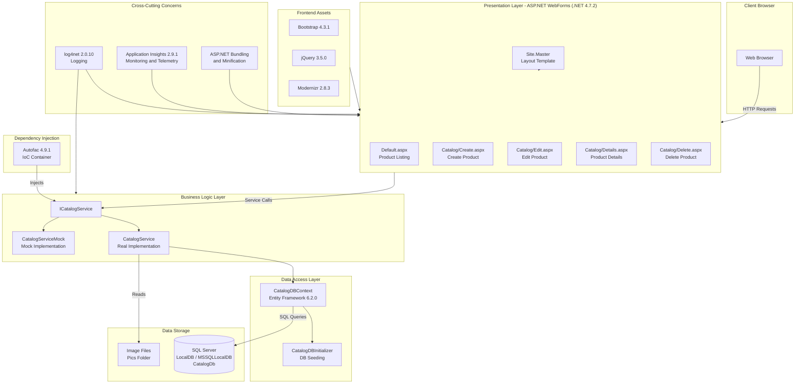

# eShopLegacyWebForms - Architecture Diagram

## Application Overview

**eShopLegacyWebForms** is a legacy ASP.NET WebForms e-commerce catalog application targeting .NET Framework 4.7.2. It provides CRUD operations for a product catalog backed by SQL Server via Entity Framework 6.

## Architecture Diagram

## Technology Stack

| Layer | Technology | Version |
|-------|-----------|---------|
| Framework | ASP.NET WebForms | .NET Framework 4.7.2 |
| ORM | Entity Framework | 6.2.0 |
| Database | SQL Server (LocalDB) | - |
| DI Container | Autofac | 4.9.1 |
| Logging | log4net | 2.0.10 |
| Monitoring | Application Insights | 2.9.1 |
| UI Framework | Bootstrap | 4.3.1 |
| JavaScript | jQuery | 3.5.0 |
| Serialization | Newtonsoft.Json | 12.0.1 |

## Key Components

- **Presentation**: ASP.NET WebForms pages for product catalog CRUD operations
- **Services**: `ICatalogService` abstraction with real (EF6+SQL) and mock implementations
- **Data Models**: `CatalogItem`, `CatalogBrand`, `CatalogType` entities
- **Database Context**: `CatalogDBContext` with Code First EF6 configuration
- **DI**: Autofac injected via HTTP modules into WebForms pages
- **Monitoring**: Application Insights for telemetry and request tracking

## Assessment Summary

The AppCAT assessment identified **7 issues** and **8 incidents** totaling **24 story points**:

- **2 Mandatory** issues requiring changes before migration
- **4 Optional** improvements recommended
- **2 Potential** issues to investigate

These findings indicate migration effort needed to move from ASP.NET WebForms on .NET Framework to a modern .NET platform (e.g., ASP.NET Core on Azure App Service).
