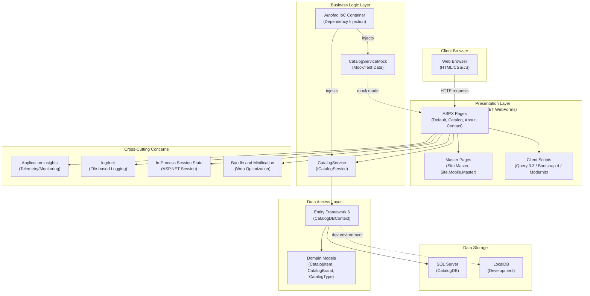

# eShopLegacyWebForms Architecture Diagram

## Architecture Summary

**Application**: eShopLegacyWebForms  
**Type**: ASP.NET WebForms  
**Framework**: .NET Framework 4.7.2  

### Key Components

| Layer | Technology |
|-------|-----------|
| Presentation | ASP.NET WebForms (ASPX pages, Master pages) |
| UI Framework | Bootstrap 4.3, jQuery 3.3, Modernizr |
| Dependency Injection | Autofac 4.9 |
| Data Access | Entity Framework 6.2 |
| Database | SQL Server / LocalDB (CatalogDB) |
| Logging | log4net 2.0 (file appender) |
| Monitoring | Microsoft Application Insights 2.9 |
| Session | ASP.NET In-Process Session State |

### Assessment Issues Summary

| Category | Count | Severity |
|----------|-------|----------|
| Scale | 2 | Optional / Potential |
| Connection | 1 | Potential |
| Database | 1 | Optional |
| Identity | 1 | **Mandatory** |
| Security | 2 | Optional |
| Local | 1 | **Mandatory** |

**Total**: 7 issues, 8 incidents, 24 story points
