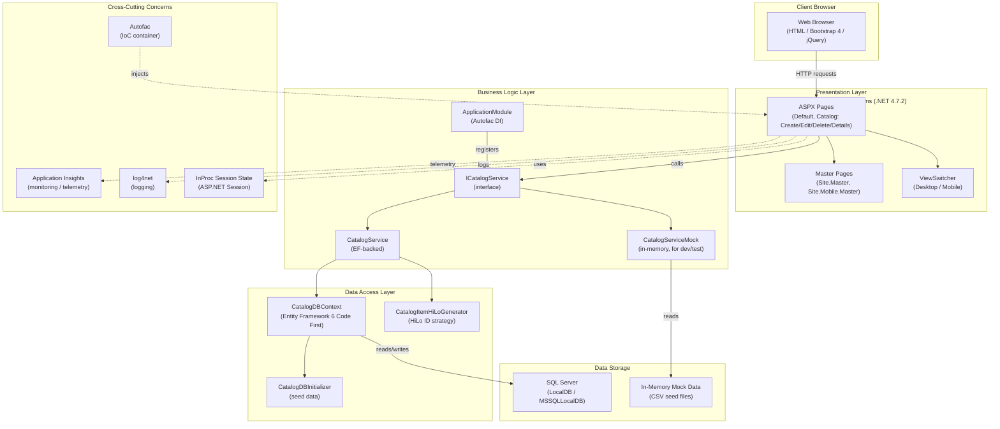

# eShopLegacyWebForms - Architecture Diagram

## Architecture Summary

| Layer | Technology |
|---|---|
| **Framework** | ASP.NET WebForms on .NET Framework 4.7.2 |
| **UI** | ASPX pages, Master Pages, Bootstrap 4, jQuery 3.3 |
| **Dependency Injection** | Autofac 4.9 (Web integration) |
| **Business Logic** | CatalogService / CatalogServiceMock (ICatalogService) |
| **Data Access** | Entity Framework 6.2 (Code First, DbContext) |
| **Database** | SQL Server (LocalDB for development) |
| **Session State** | In-Process (InProc) ASP.NET session |
| **Monitoring** | Microsoft Application Insights 2.9 |
| **Logging** | log4net 2.0 |

## Assessment Summary (AppCAT)

| Metric | Value |
|---|---|
| Total Issues | 7 |
| Total Incidents | 8 |
| Total Effort (story points) | 24 |
| Mandatory Issues | 2 |
| Optional Issues | 4 |
| Potential Issues | 2 |

**Issue Categories**: Scale, Connection, Database, Identity, Security, Local
