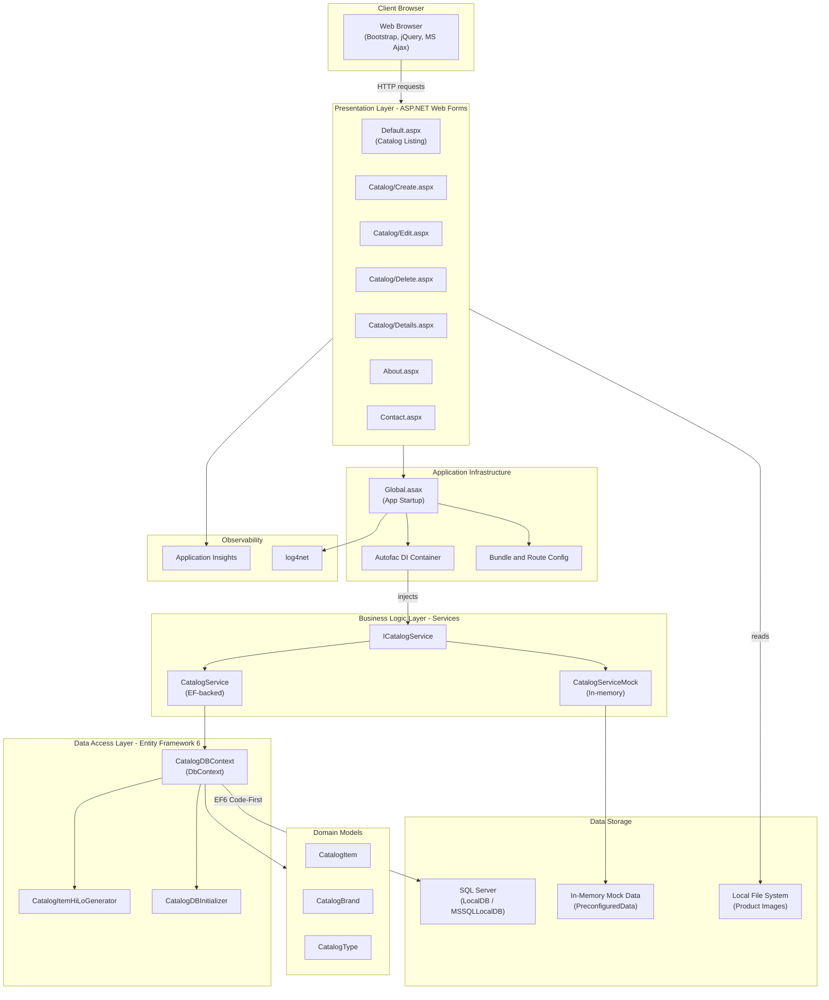

# eShopLegacyWebForms - Architecture Diagram

## Technology Stack

| Layer | Technology |
|-------|-----------|
| Framework | ASP.NET Web Forms (.NET Framework 4.x) |
| UI | ASPX pages, Bootstrap 4, jQuery 3, MS Ajax |
| Dependency Injection | Autofac 4.9 |
| ORM / Data Access | Entity Framework 6 |
| Database | SQL Server (LocalDB) |
| Logging | log4net 2.0 |
| Monitoring | Application Insights 2.9 |
| Image Storage | Local file system (Pics/) |

## Key Components

- **Catalog Management**: Full CRUD (Create, Read, Update, Delete) for catalog items
- **Mock Data Support**: Switchable between live SQL Server and in-memory mock data via `UseMockData` app setting
- **HiLo ID Generation**: Custom ID generator for catalog items to avoid DB round-trips
- **Session Tracking**: Machine name and session start time stored in session state
