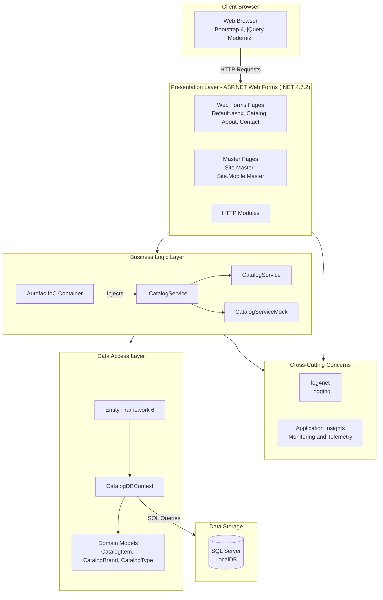

# eShopLegacyWebForms Architecture Diagram

## Technology Stack

| Layer | Technology |
|-------|------------|
| Framework | ASP.NET Web Forms on .NET Framework 4.7.2 |
| UI | Bootstrap 4, jQuery 3.5, Modernizr |
| IoC | Autofac 4.9 |
| ORM | Entity Framework 6.2 |
| Database | SQL Server (LocalDB) |
| Logging | log4net 2.0 |
| Monitoring | Application Insights 2.9 |
| Serialization | Newtonsoft.Json 12.0 |
