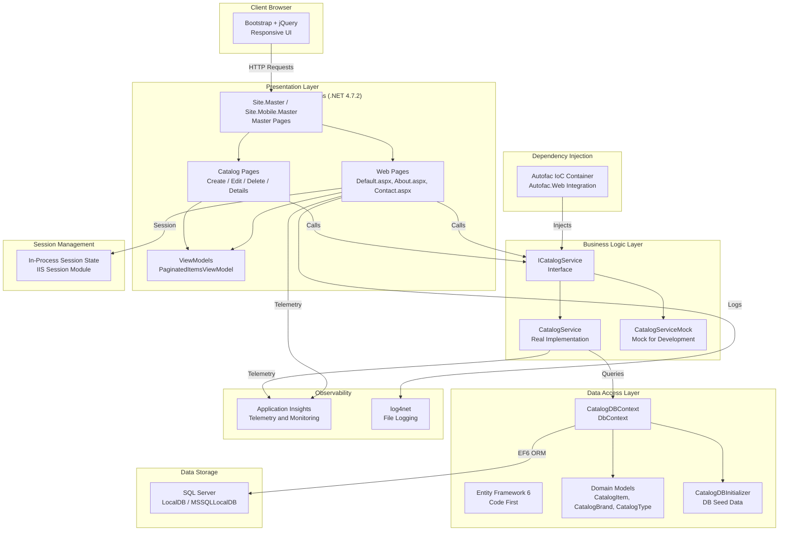

# eShopLegacyWebForms - Architecture Diagram

## Summary

**Application**: eShopLegacyWebForms  
**Type**: ASP.NET Web Forms (legacy)  
**Framework**: .NET Framework 4.7.2  

### Architecture Layers

| Layer | Technology |
|---|---|
| Presentation | ASP.NET Web Forms, Bootstrap 4, jQuery 3 |
| Business Logic | Service pattern with interface abstraction |
| Dependency Injection | Autofac 4.9 |
| Data Access | Entity Framework 6 (Code First) |
| Data Storage | SQL Server (LocalDB in dev) |
| Logging | log4net 2.0 |
| Monitoring | Application Insights 2.9 |
| Session | In-Process Session State |

### Key Assessment Findings

| Category | Issues |
|---|---|
| Scale | 2 issues - static files and in-process session not suitable for scale-out |
| Security | 2 issues - configuration contains sensitive data |
| Database | 1 issue - SQL Server connection string references LocalDB |
| Connection | 1 issue - connection string in config |
| Identity | 1 issue - Windows Integrated Security |
| Local | 1 issue - log4net file-based logging |
