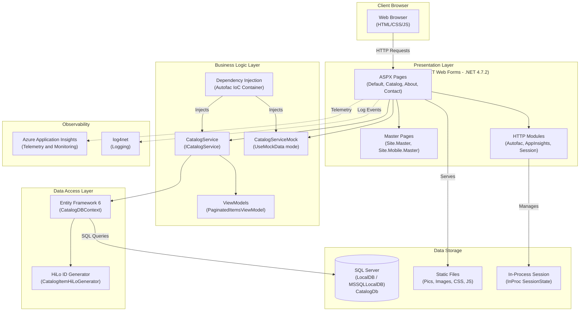

# eShopLegacyWebForms - Architecture Diagram

Generated from AppCAT assessment results.

## Application Architecture

## Technology Stack

| Layer | Technology |
|-------|-----------|
| Framework | ASP.NET Web Forms (.NET 4.7.2) |
| ORM | Entity Framework 6.2 |
| IoC Container | Autofac 4.9.1 |
| Database | SQL Server (LocalDB) |
| Front-end | Bootstrap 4.3.1, jQuery 3.5.0 |
| Monitoring | Azure Application Insights 2.9.1 |
| Logging | log4net 2.0.10 |
| Session | ASP.NET In-Process Session |
| Bundling | ASP.NET Web Optimization 1.1.3 |

## Assessment Issues Summary

| Category | Count | Severity |
|----------|-------|----------|
| Scale | 2 | Mandatory / Optional |
| Security | 2 | Mandatory / Optional |
| Connection | 1 | Optional |
| Database | 1 | Optional |
| Identity | 1 | Optional |
| Local | 1 | Potential |

**Total**: 7 issues · 8 incidents · 24 story points

> **Note**: Assessed with [.NET AppCAT](https://aka.ms/appcat) for migration targets:
> Azure App Service · Azure Kubernetes Service · Azure Container Apps · Azure App Service Container · Azure App Service Managed Instance
