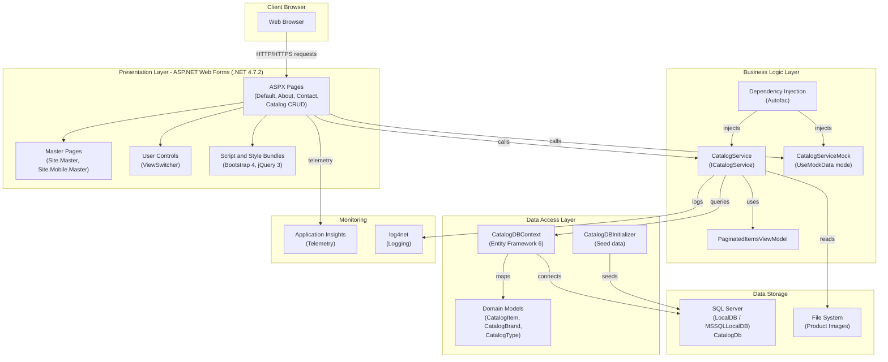

# eShopLegacyWebForms Architecture Diagram

## Technology Stack

| Layer | Technology |
|-------|-----------|
| Framework | ASP.NET Web Forms on .NET 4.7.2 |
| Presentation | ASPX Pages, Bootstrap 4.3, jQuery 3.3 |
| Dependency Injection | Autofac 4.9 |
| Data Access | Entity Framework 6.2 (Code-First) |
| Database | SQL Server (LocalDB) |
| Logging | log4net 2.0 |
| Monitoring | Microsoft Application Insights |

## Assessment Summary

- **Issues Found**: 7
- **Incidents**: 8
- **Story Points**: 24
- **Mandatory Issues**: 2
- **Optional Issues**: 4
- **Potential Issues**: 2
