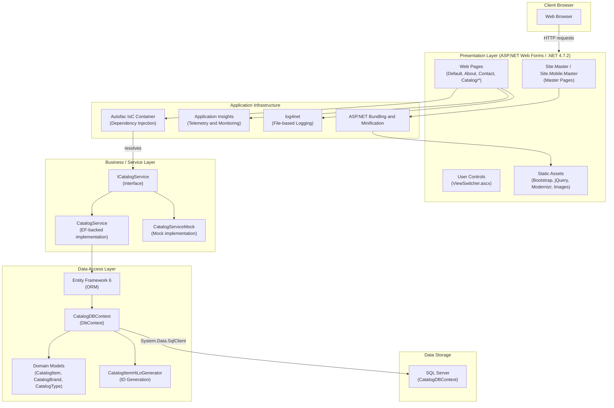

# eShopLegacyWebForms Architecture Diagram

## Architecture Summary

**Application**: eShopLegacyWebForms  
**Framework**: ASP.NET Web Forms on .NET Framework 4.7.2  
**Language**: C#

### Layers

| Layer | Technologies |
|-------|-------------|
| Presentation | ASP.NET Web Forms, Bootstrap 4, jQuery, Modernizr |
| DI / Infrastructure | Autofac 4.9, Application Insights, log4net 2.0 |
| Business / Service | ICatalogService interface with EF-backed and mock implementations |
| Data Access | Entity Framework 6, System.Data.SqlClient |
| Data Storage | SQL Server (LocalDB in development) |

### Key Assessment Findings

| Issue | Severity | Description |
|-------|----------|-------------|
| Static content | Optional | 83 static files served directly; consider Azure Blob Storage and Azure CDN |
| File-based logging | Mandatory | log4net writes to local disk; not compatible with Azure App Service or Containers |
| Connection strings | Potential | Hard-coded SQL Server connection strings; migrate database and use Azure Key Vault |
| System.Data.SqlClient | Optional | Upgrade to Microsoft.Data.SqlClient for better Azure integration |
| Windows Authentication | Mandatory | Incompatible with Azure App Service and AKS; use Azure AD authentication |
| In-proc session state | Potential | Prevents horizontal scaling; use Azure Cache for Redis or Cosmos DB |
| Secrets in config | Optional | Connection strings and app settings in Web.config; use Azure App Configuration |
